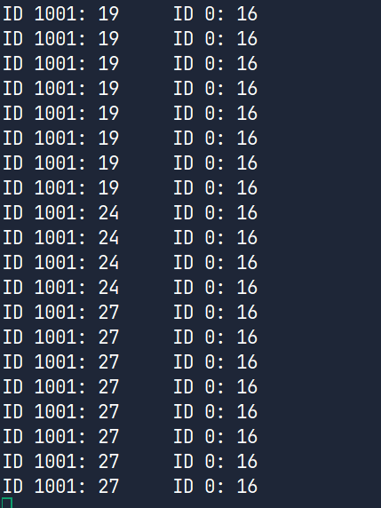

# 前置总结

> **使用XDP技术实现数据包的过滤核处理（充当防火墙、网关等）。**

两个指导性文档

https://ebpf.io/what-is-ebpf/#what-is-ebpf

https://www.brendangregg.com/blog/2019-01-01/learn-ebpf-tracing.html

eBPF程序示例

https://www.kungfudev.com/blog/2023/10/14/the-beginning-of-my-ebpf-journey-kprobe-bcc

bcc框架bcc指导书

https://github.com/iovisor/bcc/blob/master/docs/reference_guide.md

## eBPF

> 先理解相关的概念。

**extended Berkeley Packet Filter**（现在没有意义的缩写）

写代码监控内核的行为但是无需改动内核的代码，会验证安全性，用bcc或者libbpf。

hook 钩子 事件驱动的，监听在某个位置，内核函数调用或者网络事件等。

内核探针(kprobe) 用户探针(uprobe)

bcc间接调用 编写：LLVM 伪C代码编译成字节码

理解加载流程：


程序加载到**linux**内核

1.验证：进程有特权 程序不会崩溃 不是死循环

maps 存储检索收集的数据？用户态也能访问（USP和KSP通过maps来交互）。

​	tracepoint_syscalls_sys_enter_open和TracePoint_sysCalls__sys_enter_openat函数每当发出open（）/openat（）syscall时都会执行。然后，他们解析了呼叫的参数（文件名等），然后将此信息写入BPF maps。从那里，我们的编译OpenSnoop.c二进制部分 - 我们的用户空间程序（USP）可以读取并打印到Stdout。

helper 操作都通过helper函数，安全的，不能访问内核内存，修改内核的数据结构

bcc框架 用py调用 ebpf收集数据


用**bpftool**查看加载到内核的**bpf**程序

查看运行的程序

```
bpftool prog list
```

查看map

```
bpftool map list
```

dump bpf程序的源代码

```
bpftool prog dump xlated id 46 linum
```

做了官网上的两个基础小lab。


简单的ebpf程序的实例

```python
from bcc import BPF

program = r"""
int hello(void *ctx) {
    bpf_trace_printk("Hello World!");
    return 0;
}
"""

b = BPF(text=program)
syscall = b.get_syscall_fnname("execve")
b.attach_kprobe(event=syscall, fn_name="hello")

b.trace_print()

```

maps:

​	eBPF Maps are data structures that can be accessed from within eBPF  programs in the kernel, and from user space applications. They can be  used to share information **between eBPF programs and with user space code** - for example, to pass configuration into an eBPF program, or to send  observability data collected in the kernel to user space.

map程序的示例：

每两秒会打印整个hashmap，有哪些用户执行了多少个程序。

```python
#!/usr/bin/python3  
from bcc import BPF
from time import sleep

program = r"""
BPF_HASH(counter_table);

int hello(void *ctx) {
   u64 uid;
   u64 counter = 0;
   u64 *p;

   uid = bpf_get_current_uid_gid() & 0xFFFFFFFF;
   p = counter_table.lookup(&uid);
   if (p != 0) {
      counter = *p;
   }
   counter++;
   counter_table.update(&uid, &counter);
   return 0;
}
"""

b = BPF(text=program)
syscall = b.get_syscall_fnname("execve")
b.attach_kprobe(event=syscall, fn_name="hello")

# Attach to a tracepoint that gets hit for all syscalls 
# b.attach_raw_tracepoint(tp="sys_enter", fn_name="hello")

while True:
    sleep(2)
    s = ""
    for k,v in b["counter_table"].items():
        s += f"ID {k.value}: {v.value}\t"
    print(s)

```

得到了输出：



可以修改要监听的行为：比如sys_enter

bpftool用法

```
bpftool prog show ([id/name/tag])
```

获取map信息 

利用map_id

```
bpftool map show id [map_id]
```

```shell
root@server:~# bpftool map show id $MAP_ID 
23: hash  name counter_table  flags 0x0
        key 8B  value 8B  max_entries 10240  memlock 919232B
        btf_id 101
        pids hello-map.py(4550)
```

展示map的类型以及字段的大小。


```
bpftool map dump id [map_id]
```

直接查看map存储的内容。


```
bpftool map update id $MAP_ID key 5 0 0 0 0 0 0 0 value 0 0 0 0 0 0 0 1
```

修改map的值，注意字节的高低位置。


## XDP

eXpress data Path can examine packets as soon as they arrive on an interface, before they have been passed to the kernel's network stack.

操纵network packets

简单的示例程序：

```C
#include <linux/bpf.h>
#include <bpf/bpf_helpers.h>

int counter = 0;

//section macro 程序的类型，连接到网络的接口
SEC("xdp")
int hello(struct xdp_md *ctx) {
    bpf_printk("Hello World %d", counter);
    counter++; 
    //计数并且通过这个packet
    return XDP_PASS;
}

char LICENSE[] SEC("license") = "Dual BSD/GPL";

```

make 编译


```
bpftool prog load hello.bpf.o /sys/fs/bpf/hello
```

把.o文件加载到内核


```
bpftool net attach xdp name hello dev lo
```

把这个程序接到某个网络接口


```
bpftool net list
```

列出和网络有关的eBPF程序


```
bpftool prog trace log
```

记录了trace，但是是所有的


那么ping了127.0.0.1就会有结果：

```
 <...>-4323    [007] ..s11  2593.019030: bpf_trace_printk: Hello World 0
           <...>-4323    [007] ..s11  2593.019045: bpf_trace_printk: Hello World 1
            ping-4323    [007] ..s11  2594.021059: bpf_trace_printk: Hello World 2
            ping-4323    [007] ..s11  2594.021079: bpf_trace_printk: Hello World 3
            ping-4323    [007] ..s11  2595.045051: bpf_trace_printk: Hello World 4
            ping-4323    [007] ..s11  2595.045073: bpf_trace_printk: Hello World 5
            ping-4323    [007] ..s11  2596.069044: bpf_trace_printk: Hello World 6
            ping-4323    [007] ..s11  2596.069062: bpf_trace_printk: Hello World 7
            ping-4323    [007] ..s11  2597.093032: bpf_trace_printk: Hello World 8
            ping-4323    [007] ..s11  2597.093053: bpf_trace_printk: Hello World 9
            ping-4323    [007] ..s11  2598.117031: bpf_trace_printk: Hello World 10
```

每次增加两个，是因为ping的Request和Reply？


怎么移除？

```
bpftool net detach xdp  dev lo
```

解除绑定


```
rm /sys/fs/bpf/hello
```

从内核中卸载


```
ip link set dev lo xdp obj hello.bpf.o sec xdp
```

直接用ip绑定


​	如果把上面的程序改称 return XDP_DROP;那么就不能ping通了，根据ip地址来drop的话就能达到防火墙的效果。


Verifier：验证eBPF程序的安全性

## 第二篇博客：

​	For tracing, the main ones are **[bcc](https://github.com/iovisor/bcc)** and **[bpftrace](https://github.com/iovisor/bpftrace)**. These don't live in the kernel code base, they live in a Linux Foundation project on github called **iovisor**.

安装bpfcc-tools

```
sudo apt update
sudo apt install -y bpfcc-tools linux-headers-$(uname -r) libbpfcc-dev python3-bpfcc
```


调用exec跟踪,监测的工具放在sbin目录下方。

```
sudo /usr/sbin/execsnoop-bpfcc
```


入门bcc：

查看性能的工具：

**1. uptime**: 运行时间 登陆用户数量 cpu平均负载

```shell
─ ~ ▓▒░···············································░▒▓ ✔  at 07:17:49 PM ─╮
╰─ uptime                                                                    ─╯
 19:25:57 up  2:09,  1 user,  load average: 1.05, 0.46, 0.27

```

**2. dmesg | tail**

查看内核的消息缓冲区：错误日志，驱动加载等

```shell
╭─ ~ ▓▒░·····································································░▒▓ 1|0 ✔  at 07:28:53 PM ─╮
╰─ sudo dmesg | tail                                                                                   ─╯
[sudo] password for mostima: 
[ 6821.941975] atkbd serio0: Unknown key released (translated set 2, code 0xab on isa0060/serio0).
[ 6821.941990] atkbd serio0: Use 'setkeycodes e02b <keycode>' to make it known.
[ 7197.175842] atkbd serio0: Unknown key pressed (translated set 2, code 0xab on isa0060/serio0).
[ 7197.175866] atkbd serio0: Use 'setkeycodes e02b <keycode>' to make it known.
[ 7197.187243] atkbd serio0: Unknown key released (translated set 2, code 0xab on isa0060/serio0).
[ 7197.187258] atkbd serio0: Use 'setkeycodes e02b <keycode>' to make it known.
[ 7491.918549] atkbd serio0: Unknown key pressed (translated set 2, code 0xab on isa0060/serio0).
[ 7491.918568] atkbd serio0: Use 'setkeycodes e02b <keycode>' to make it known.
[ 7491.928139] atkbd serio0: Unknown key released (translated set 2, code 0xab on isa0060/serio0).
[ 7491.928142] atkbd serio0: Use 'setkeycodes e02b <keycode>' to make it known.

```

**3. vmstat 1**

虚拟内存统计

`r`：等待 CPU 的进程数

`b`：处于不可中断睡眠的进程数（如等待 I/O）

`free`：空闲内存

`si/so`：交换分区的读写（Swap in/out）

```shell
╭─ ~ ▓▒░·······································································░▒▓ 1 х  at 07:30:32 PM ─╮
╰─ vmstat 1                                                                                            ─╯
procs -----------memory---------- ---swap-- -----io---- -system-- ------cpu-----
 r  b   swpd   free   buff  cache   si   so    bi    bo   in   cs us sy id wa st
 1  1      0 4376372 152684 5632060    0    0    14     8   58  106  0  0 99  0  0
 0  0      0 4376624 152716 5632056    0    0     0   128  485 1009  0  0 100  0  0
 0  0      0 4376860 152716 5632056    0    0     0     4  232  686  0  0 100  0  0
 1  0      0 4377400 152724 5632048    0    0     0   184  324  716  0  0 100  0  0
 0  0      0 4377568 152724 5632048    0    0     0     0  200  623  0  0 100  0  0
 0  0      0 4377436 152724 5632056    0    0     0     0  255  694  0  0 100  0  0
 0  0      0 4377896 152724 5632056    0    0     0     0  227  674  0  0 100  0  0

```

**4. top**

显示占用资源最多的进程

**5. pidstat mpstat iostat**

查看相关资源的利用。

**6. free -m**

查看内存使用情况。

```shell
─ ~ ▓▒░·········································································░▒▓ ✔  at 07:36:56 PM ─╮
╰─ free -m                                                                                             ─╯
               total        used        free      shared  buff/cache   available
Mem:           13663        3791        4194        1071        5677        8460
Swap:          15624           0       15624

```

***7. sar -n DEV 1**

每一秒钟查看所有网络接口的流量。

```shell
╭─ ~ ▓▒░·········································································░▒▓ ✔  at 07:36:58 PM ─╮
╰─ sar -n DEV 1                                                                                        ─╯
Linux 6.8.0-58-generic (mostima-OMEN-by-HP-Gaming-Laptop-16-wf0xxx) 	05/01/2025 	_x86_64_	(32 CPU)

07:42:52 PM     IFACE   rxpck/s   txpck/s    rxkB/s    txkB/s   rxcmp/s   txcmp/s  rxmcst/s   %ifutil
07:42:53 PM        lo      0.00      0.00      0.00      0.00      0.00      0.00      0.00      0.00
07:42:53 PM      eno1      0.00      0.00      0.00      0.00      0.00      0.00      0.00      0.00
07:42:53 PM      wlo1      1.00      1.00      0.06      0.08      0.00      0.00      0.00      0.00
07:42:53 PM ovs-system      0.00      0.00      0.00      0.00      0.00      0.00      0.00      0.00
07:42:53 PM       br0      0.00      0.00      0.00      0.00      0.00      0.00      0.00      0.00
07:42:53 PM    brConn      0.00      0.00      0.00      0.00      0.00      0.00      0.00      0.00
07:42:53 PM    lxcbr0      0.00      0.00      0.00      0.00      0.00      0.00      0.00      0.00
07:42:53 PM   docker0      0.00      0.00      0.00      0.00      0.00      0.00      0.00      0.00

```

**8. sar -n TCP,ETCP 1**

每一秒查看TCP协议栈的统计数据：

```shell
─ ~ ▓▒░·········································································░▒▓ ✔  at 07:44:06 PM ─╮
╰─ sar -n TCP,ETCP 1                                                                                   ─╯
Linux 6.8.0-58-generic (mostima-OMEN-by-HP-Gaming-Laptop-16-wf0xxx) 	05/01/2025 	_x86_64_	(32 CPU)

07:45:34 PM  active/s passive/s    iseg/s    oseg/s
07:45:35 PM      0.00      0.00      0.00      0.00

07:45:34 PM  atmptf/s  estres/s retrans/s isegerr/s   orsts/s
07:45:35 PM      0.00      0.00      0.00      0.00      0.00

07:45:35 PM  active/s passive/s    iseg/s    oseg/s
07:45:36 PM      0.00      0.00      0.00      0.00

07:45:35 PM  atmptf/s  estres/s retrans/s isegerr/s   orsts/s
07:45:36 PM      0.00      0.00      0.00      0.00      0.00

07:45:36 PM  active/s passive/s    iseg/s    oseg/s
07:45:37 PM      0.00      0.00      2.00      2.00

07:45:36 PM  atmptf/s  estres/s retrans/s isegerr/s   orsts/s
07:45:37 PM      0.00      0.00      0.00      0.00      0.00

07:45:37 PM  active/s passive/s    iseg/s    oseg/s
07:45:38 PM      1.00      1.00     13.00     13.00

```

简单bcc工具的使用：

https://github.com/iovisor/bcc/blob/master/docs/tutorial.md

tcpconnected:

监测已经建立的tcp连接。


**bpftrace** 也是一种工具，先不管。


kunfudev: 监测clone程序。

跟着手写了一遍这个简单的程序：

```python
from bcc import BPF
import time
# 定义eBPF程序作为一个string
# 这个头文件定义了一些用户空间可见的接口
# eBPF程序的入口函数之一syscall__[name]
bpf_program = r"""
    #include<uapi/linux/ptrace.h>
    int syscall__clone(struct pt_regs *ctx)
    {
        bpf_trace_printk("Hello, clone\\n");
        return 0;
    }
"""

# 加载这个程序
b = BPF(text = bpf_program)

# 把内核探针挂载上去

event_name = b.get_syscall_fnname("clone")
b.attach_kprobe(event=event_name, fn_name="syscall__clone")


# 打印信息
try:
    print("OK,kprobe is already attached to sys__clone...\n")
    b.trace_print()
except KeyboardInterrupt:
    print("you want to exit with ctrl + C, don't you???\n")
    time.sleep(5)
    print("Ok,you can\n")
    pass

```


