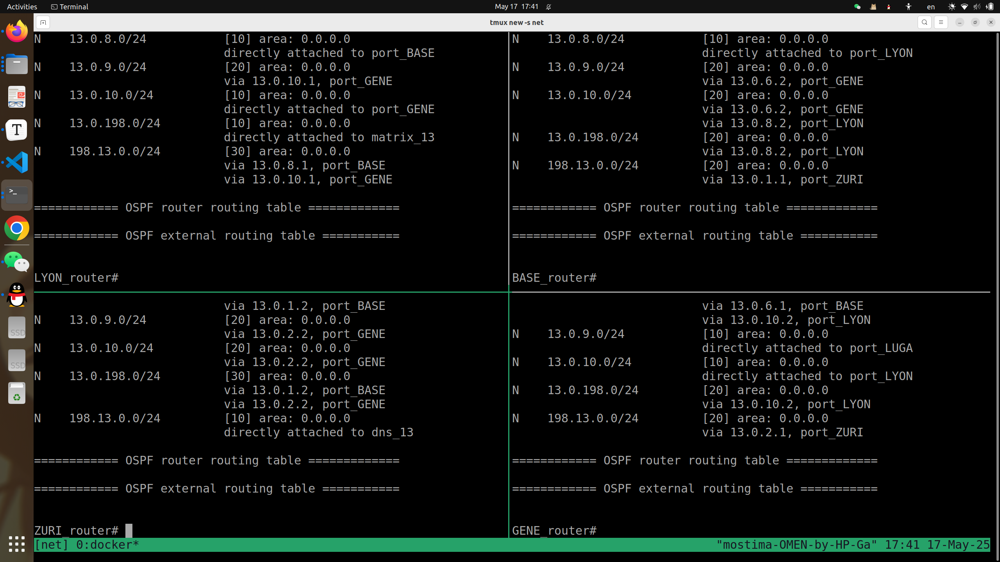
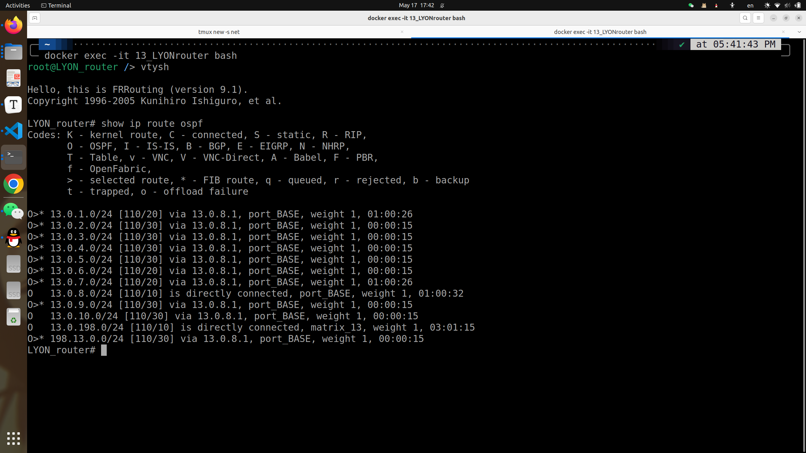
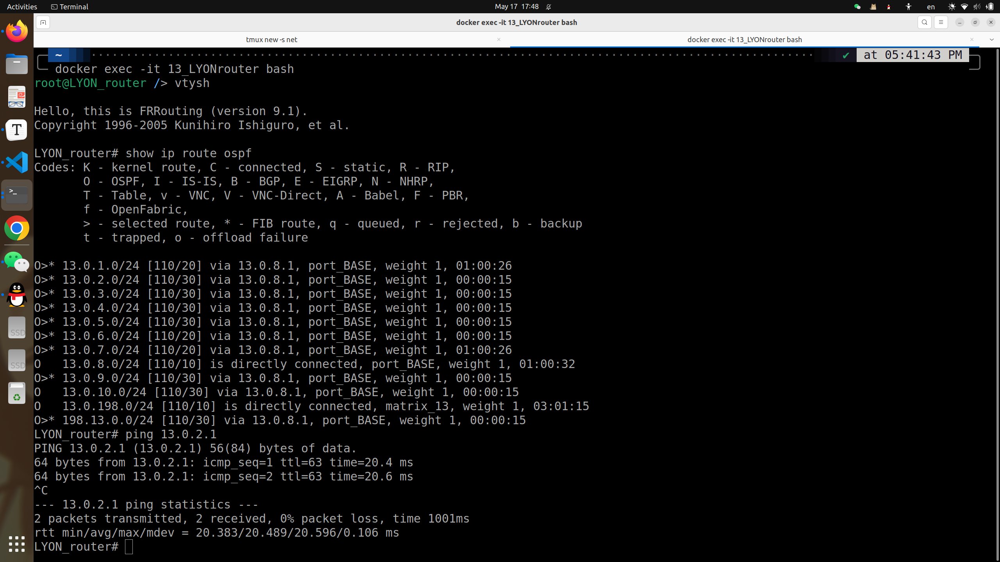
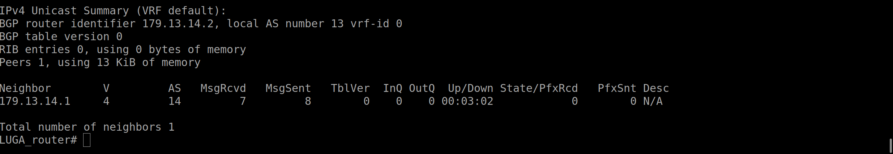
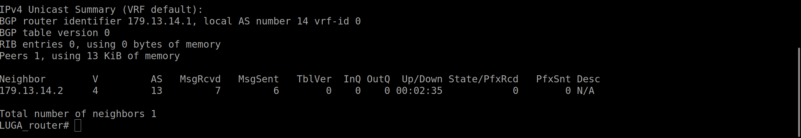

# Mini_Project

> 简单的网络实践的记录。

## 1.主机配置

### 1.查看现有的网络接口

```
ip address show
```

```
ip a
```

```shell
root@MUNI_router /> ip a
1: lo: <LOOPBACK,UP,LOWER_UP> mtu 65536 qdisc noqueue state UNKNOWN group default qlen 1000
    link/loopback 00:00:00:00:00:00 brd 00:00:00:00:00:00
    inet 127.0.0.1/8 scope host lo
       valid_lft forever preferred_lft forever
    inet6 ::1/128 scope host proto kernel_lo 
       valid_lft forever preferred_lft forever
2: ssh@if155: <BROADCAST,MULTICAST,UP,LOWER_UP> mtu 1500 qdisc noqueue state UP group default 
    link/ether 8e:34:ac:86:86:55 brd ff:ff:ff:ff:ff:ff link-netnsid 0
    inet 158.13.14.1/16 brd 158.13.255.255 scope global ssh
       valid_lft forever preferred_lft forever
436: port_ZURI@if437: <BROADCAST,MULTICAST,UP,LOWER_UP> mtu 1500 qdisc netem state UP group default qlen 1000
    link/ether a2:cd:16:18:07:a5 brd ff:ff:ff:ff:ff:ff link-netnsid 2
    inet6 fe80::a0cd:16ff:fe18:7a5/64 scope link proto kernel_ll 
       valid_lft forever preferred_lft forever
442: port_BASE@if443: <BROADCAST,MULTICAST,UP,LOWER_UP> mtu 1500 qdisc netem state UP group default qlen 1000
    link/ether de:ce:64:eb:12:a1 brd ff:ff:ff:ff:ff:ff link-netnsid 3
    inet6 fe80::dcce:64ff:feeb:12a1/64 scope link proto kernel_ll 
       valid_lft forever preferred_lft forever
490: ext_11_ZURI@if491: <BROADCAST,MULTICAST,UP,LOWER_UP> mtu 1500 qdisc netem state UP group default qlen 1000
    link/ether 3a:cd:b8:b3:47:6f brd ff:ff:ff:ff:ff:ff link-netnsid 4
    inet6 fe80::38cd:b8ff:feb3:476f/64 scope link proto kernel_ll 
       valid_lft forever preferred_lft forever
248: host@if249: <BROADCAST,MULTICAST,UP,LOWER_UP> mtu 1500 qdisc noqueue state UP group default qlen 1000
    link/ether e2:17:05:a4:4c:3b brd ff:ff:ff:ff:ff:ff link-netnsid 1
    inet6 fe80::e017:5ff:fea4:4c3b/64 scope link proto kernel_ll 
       valid_lft forever preferred_lft forever
```

### 2.查看现有的网关 gateway

```shell
ip route
```


```shell
root@MUNI_router /> ip route
158.13.0.0/16 dev ssh proto kernel scope link src 158.13.14.1 
```

### 3.给网关分配IP地址

```shell
ip address add IP/SUBNET_SIZE dev INTERFACENAME 
```

```shell
root@MUNI_router /> ip addr add 13.0.4.2/24 dev port_ZURI 
```

```shell
436: port_ZURI@if437: <BROADCAST,MULTICAST,UP,LOWER_UP> mtu 1500 qdisc netem state UP group default qlen 1000
    link/ether a2:cd:16:18:07:a5 brd ff:ff:ff:ff:ff:ff link-netnsid 2
    inet 13.0.4.2/24 scope global port_ZURI
       valid_lft forever preferred_lft forever
    inet6 fe80::a0cd:16ff:fe18:7a5/64 scope link proto kernel_ll 
       valid_lft forever preferred_lft forever
```

结果如上所示。

那么删除IP地址类似：

```shell
ip address add IP/SUBNET_SIZE dev INTERFACENAME 
```

​	子网声明显示的告诉host哪些IP是可达的，但它没有办法访问其余主机，所以我们要设置默认网关处理未知的IP地址，添加到默认网关的路由：

```
ip route add default via IP_ADDRESS
```

删除类似：

```
ip route del default via IP_ADDRESS
```

## 2.配置Open vSwitch

软件定义的交换机。

### 1.查看交换机概况：

```shell
root@S1 /> ovs-vsctl show 
64ed0e35-4f96-4ae6-9abc-ab874080e33a
    Bridge br0
        fail_mode: standalone
        Port ZURIrouter
            trunks: [10, 20, 30]
            Interface ZURIrouter
        Port "3-UEFA_1"
            tag: 20
            Interface "3-UEFA_1"
        Port "3-S2"
            trunks: [10, 20, 30]
            Interface "3-S2"
        Port br0
            Interface br0
                type: internal
        Port "3-FIFA_1"
            tag: 10
            Interface "3-FIFA_1"
        Port "3-S3"
            trunks: [10, 20, 30]
            Interface "3-S3"
    ovs_version: "2.17.9"
```

### 2.获取具体的接口状态：

> 这里的带宽和实际分配的不符合。

```sh
oot@S1 /> ovs-ofctl show br0
OFPT_FEATURES_REPLY (xid=0x2): dpid:0000468b25730d40
n_tables:254, n_buffers:0
capabilities: FLOW_STATS TABLE_STATS PORT_STATS QUEUE_STATS ARP_MATCH_IP
actions: output enqueue set_vlan_vid set_vlan_pcp strip_vlan mod_dl_src mod_dl_dst mod_nw_src mod_nw_dst mod_nw_tos mod_tp_src mod_tp_dst
 1(13-S2): addr:8e:58:70:1e:06:75
     config:     0
     state:      STP_FORWARD
     current:    10GB-FD COPPER
     speed: 10000 Mbps now, 0 Mbps max
 2(13-S3): addr:46:38:bc:aa:eb:00
     config:     0
     state:      STP_FORWARD
     current:    10GB-FD COPPER
     speed: 10000 Mbps now, 0 Mbps max
 3(13-FIFA_1): addr:92:9d:0f:74:f2:87
     config:     0
     state:      STP_FORWARD
     current:    10GB-FD COPPER
     speed: 10000 Mbps now, 0 Mbps max
 4(13-UEFA_1): addr:7a:f4:9f:39:3f:c8
     config:     0
     state:      STP_FORWARD
     current:    10GB-FD COPPER
     speed: 10000 Mbps now, 0 Mbps max
 5(ZURIrouter): addr:72:b5:99:54:27:29
     config:     0
     state:      STP_FORWARD
     current:    10GB-FD COPPER
     speed: 10000 Mbps now, 0 Mbps max
 LOCAL(br0): addr:46:8b:25:73:0d:40
     config:     PORT_DOWN
     state:      LINK_DOWN
     speed: 0 Mbps now, 0 Mbps max
OFPT_GET_CONFIG_REPLY (xid=0x4): frags=normal miss_send_len=0

```

### 3.VLAN的配置

​	**VLAN（Virtual Local Area Network，虚拟局域网）是一种将一个物理局域网逻辑划分为多个广播域的网络技术。通过 VLAN，我们可以让不同物理位置的设备看起来像在同一个局域网中，或者让处于同一物理网络的设备分属于不同的网络。**

​	端口只能携带VLAN = 10的流量。

```sh
ovs-vsctl set port 84-A_AU tag=10
```

​	端口能够携带VLAN = 10 或者 20的流量。

```sh
ovs-vsctl set port PORT_NAME trunks=10,20
```

## 3.*路由器配置

### 1. The FRRouting CLI

vtysh

```plaintext
router# ?
    clear       Reset functions
    configure   Configuration from vty interface
    exit        Exit current mode and down to previous mode
    no          Negate a command or set its defaults
    ping        Send echo messages
    quit        Exit current mode and down to previous mode
    show        Show running system information
    traceroute  Trace route to destination
    write       Write running configuration to memory, network, or terminal
```

问号列出当前的可行操作。

no 做前缀撤销刚才的命令。

### 2.配置路由接口

​	router通过IP接口来连接IP网络，从某个接口接收了数据包的时候，它根据路由表决定从哪里转出。

​	接口命名规范。

​	Each router has interfaces to its neighboring routers whose names follow the pattern `port_<neighbor>`. For instance, the interface on `ACCR` connected to `LUAN` is named `port_LUAN`. Moreover, each router has an interface connected to the host named `host` and a loopback interface called `lo`. An interface connected to another AS is called `ext_<AS-number>_<router-name>`. For example, the interface on `CAPE` in AS 84 connected to `ADDI` in AS 86 has the name `ext_86_ADDI`.

展示接口状态：

```sh
ZURI_router# show interface 
Interface ZURI-L2 is up, line protocol is up
  Link ups:       4    last: 2025/05/17 02:43:46.80
  Link downs:     1    last: 2025/05/17 02:41:30.90
  vrf: default
  index 280 metric 0 mtu 1500 speed 10000 txqlen 1000
  flags: <UP,BROADCAST,RUNNING,MULTICAST>
  Type: Ethernet
  HWaddr: 92:e4:8f:ed:10:a7
  inet6 fe80::90e4:8fff:feed:10a7/64
  Interface Type VETH
  Interface Slave Type None
  protodown: off 
  Parent ifindex: 281
Interface ZURI-L2.10 is down
  Link ups:       0    last: (never)
  Link downs:     0    last: (never)
  vrf: default
  index 5 metric 0 mtu 1500 speed 10000 txqlen 1000
  flags: <BROADCAST,MULTICAST>
  Type: Ethernet
  HWaddr: 92:e4:8f:ed:10:a7
  Interface Type Vlan
  Interface Slave Type None
  VLAN Id 10
  protodown: off 
  Parent interface: ZURI-L2
```

```sh
ZURI_router# show interface brief 
Interface       Status  VRF             Addresses
---------       ------  ---             ---------
ZURI-L2         up      default         
ZURI-L2.10      down    default         
ZURI-L2.20      down    default         
ZURI-L2.30      down    default         
dns_13          up      default         198.13.0.1/24
host            up      default         
lo              up      default         
port_BASE       up      default         
port_GENE       up      default         
port_LUGA       up      default         
port_MUNI       up      default         
port_VIEN       up      default         
ssh             up      default         158.13.10.1/16
```

更改接口配置，先进入配置模式（配置一下IP地址）：

```sh
ZURI_router# conf t
ZURI_router(config)# interface port_BASE 
ZURI_router(config-if)# ip address 1.0.0.1/24
ZURI_router(config-if)# no ip address 1.0.0.1/24
```

展示有哪些IP地址可以作为目标：

```sh
ZURI_router# show ip route connected 
Codes: K - kernel route, C - connected, S - static, R - RIP,
       O - OSPF, I - IS-IS, B - BGP, E - EIGRP, N - NHRP,
       T - Table, v - VNC, V - VNC-Direct, A - Babel, F - PBR,
       f - OpenFabric,
       > - selected route, * - FIB route, q - queued, r - rejected, b - backup
       t - trapped, o - offload failure

C>* 158.13.0.0/16 is directly connected, ssh, 01:00:44
C>* 198.13.0.0/24 is directly connected, dns_13, 00:57:05
```

​	如果来的数据包的目标IP地址不在其中，那么就会被drop掉，如果要ping remote的地址，就要使用OSPF以及BGP protocol。

### 3.配置静态路由

```
router# conf t
router(config)# ip route 3.0.0.0/24 2.0.0.2
router(config)# ip route 4.0.0.0/24 someinterface
```

直接指定：指向3.0.0.0的traffic都从2.0.0.2出发。

而协议都是动态的。

```
show ip route static
```

显示静态路由。

### 4.OSPF协议设置

把对应的子网加入协议，并且设置自己的router-id

```
router# conf t
router(config)# router ospf
router(config-router)# ospf router-id 3.151.0.1
router(config-router)# network 3.151.0.0/24 area 0
router(config-router)# network 3.0.1.0/24 area 0
router(config-router)# exit
router(config)# exit
```

> ⚠️ This is not the complete configuration for `CAIR`. Be sure to include all connected (internal) subnets. **Do not** include the subnets between you and your eBGP peers.
>
> 只能包含内部连接的network，不能包含和边界路由之间的network？

展示OSPF邻居：

```plaintext
router# show ip ospf neighbor
Neighbor ID     Pri State           Up Time         Dead Time Address         Interface                        RXmtL RqstL DBsmL
3.152.0.1         1 Full/DR         21h25m03s         37.053s 3.0.1.2         port_KHAR:3.0.1.1                    0     0     0
3.157.0.1         1 Full/Backup     21h24m39s         34.036s 3.0.2.2         port_KINS:3.0.2.1                    0     0     0
3.158.0.1         1 Full/Backup     21h24m39s         38.484s 3.0.3.2         port_ACCR:3.0.3.1                    0     0     0
```

查看学习到的路由路径，第四行的经过3.0.1.2到达3.0.4.0,就是通过OSPF学习到的路径：

数字110之后的是权重。

```plaintext
router# show ip route ospf
O   3.0.1.0/24 [110/1] is directly connected, port_KHAR, weight 1, 21:28:48
O   3.0.2.0/24 [110/1] is directly connected, port_KINS, weight 1, 21:29:44
O   3.0.3.0/24 [110/1] is directly connected, port_ACCR, weight 1, 21:29:44
O>* 3.0.4.0/24 [110/2] via 3.0.1.2, port_KHAR, weight 1, 21:28:38
(...)
```

每个link都有一个权重，你可以设置这个权重：

```plaintext
router# conf t
router(config)# interface INTERFACENAME
router(config-if)# ip ospf cost 900
```

### **子网配置OSPF的结果



给四个router都配置上OSPF协议，并且之前按照图片分配IP地址。



一个路由器通过学习拿到了很多地址。



能ping通远端路由器的接口IP，表明没有问题。

### 5.配置BGP协议

配置自己的AS号和别人的AS号。

```plaintext
router# conf t
router(config)# router bgp 2
router(config-router)# neighbor 179.2.15.123 remote-as 15
router(config-router)# neighbor 2.151.0.1 remote-as 2
```

AS号不同---》eBGP

AS号相同---》同一个AS的BGP通信？

这里的地址应该设置成对方的接口，两边都要进行设置。

```
LUGA_router# conf t
LUGA_router(config)# router bgp 13
LUGA_router(config-router)# neighbor 179.13.14.1 remote-as 14
LUGA_router(config-router)# neighbor 179.13.14.1 route-map ACCEPT_ALL in
LUGA_router(config-router)# neighbor 179.13.14.1 route-map ACCEPT_ALL out
```

### **配置BGP的结果，把AS13和AS14连接通信：





​	可以看到建立了邻居关系,在边界路由器上把这个网段设置到OSPF，这样，AS13子网中的router都能ping到AS14。

问题：

​	我是将AS13和AS14通过各自的边界路由器LUGA相连接，并且把**连接的网段**(179.13.14.0/24)公布到OSPF，但是AS13内部的router只能ping通AS13的边界路由上的接口，但是ping不通AS14上边界路由的接口。

> 最后又进行了一遍配置，就没有太大的问题了。


